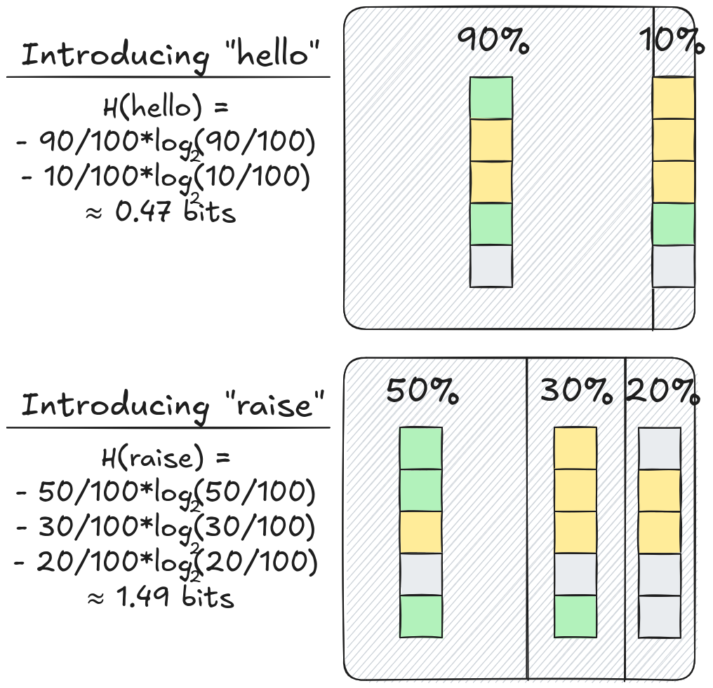
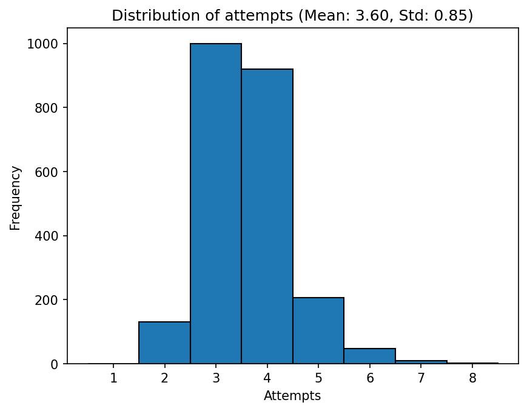
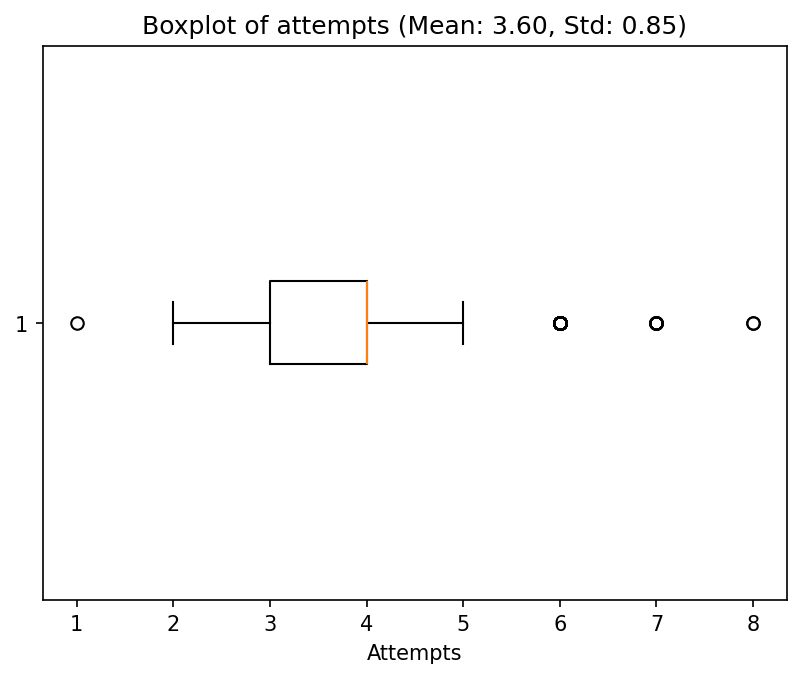
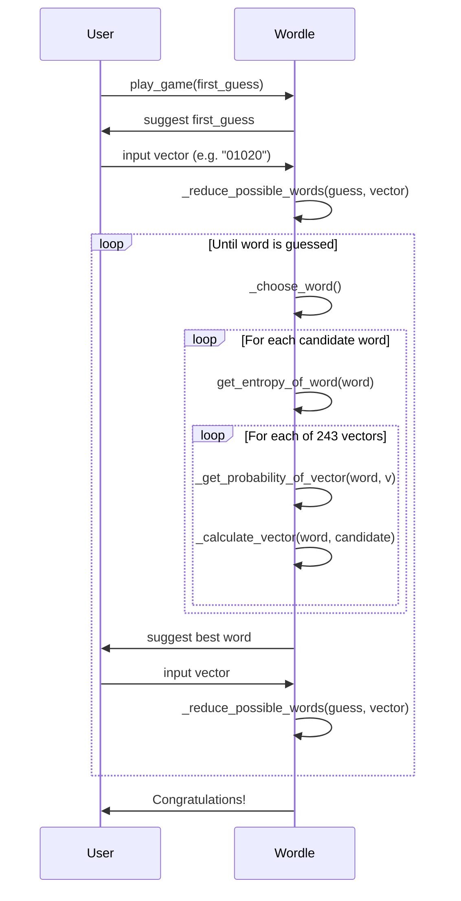

# 🟩 Wordle Solver

A Wordle solver based on **Information Theory**, inspired by [this video](https://www.youtube.com/watch?v=v68zYyaEmEA) from 3Blue1Brown. At each turn, the solver picks the word that maximizes the expected information gain (Shannon entropy), narrowing down the list of possible words as fast as possible.

## The math behind it

### Information and entropy

When we make a guess in Wordle, the game responds with a color pattern (vector). Each pattern gives us **information** — it eliminates some words from the list of possibilities. The amount of information gained from observing a pattern $v$ with probability $p(v | \text{guess})$ is:

$$I(v, \text{guess}) = \log_2\left(\frac{1}{p(v | \text{guess})}\right) = -\log_2(p(v | \text{guess}))$$

The rarer the pattern, the more information it carries. If a pattern eliminates 99% of words, it's very informative.

The **entropy** of a guess is the expected information over all possible patterns:

$$ H(\text{guess}) = \sum_{v \in \mathcal{V}} p(v | \text{guess}) \cdot I(v, \text{guess}) = -\sum_{v \in \mathcal{V}} p(v | \text{guess}) \cdot \log_2(p(v | \text{guess})), $$

where $\mathcal{V}$ is the set of all $3^5 = 243$ possible color patterns, and $p(v | \text{guess})$ is the fraction of remaining words that would produce pattern $v$ if we play that guess.

### Example

Suppose there are 100 possible words remaining and we guess a word. If the resulting pattern matches 50 of those words, then $p = 50/100 = 0.5$ and the information gained is:

$$I = -\log_2(0.5) = 1 \text{ bit}$$

But if the pattern only matches 3 words out of 100, then $p = 3/100 = 0.03$ and:

$$I = -\log_2(0.03) \approx 5.06 \text{ bits}$$

The rarer the pattern, the more it narrows down the possibilities.

Now consider two guesses ("hello" and "raise") with 100 remaining words:

- **Guess "hello"** produces 2 patterns: one matching 90 words and another matching 10 words.

$$H(\text{hello}) = -\frac{90}{100} \cdot \log_2\left(\frac{90}{100}\right) - \frac{10}{100} \cdot \log_2\left(\frac{10}{100}\right) \approx 0.47 \text{ bits}$$

- **Guess "raise"** produces 3 patterns: matching 50, 30, and 20 words respectively.

$$H(\text{raise}) = -\frac{50}{100} \cdot \log_2\left(\frac{50}{100}\right) - \frac{30}{100} \cdot \log_2\left(\frac{30}{100}\right) - \frac{20}{100} \cdot \log_2\left(\frac{20}{100}\right) \approx 1.49 \text{ bits}$$

Guess "raise" has higher entropy because it splits the possibilities into more, smaller groups — on average we learn more per turn. The best case would be if we introduce "hello" and end up with the $10\%$ of the words. However, in mean, it's better to introduce "raise", as we will probably end up with a smaller group.



### Algorithm

1. For each candidate word, compute its entropy over all 243 possible patterns.
2. Pick the word with the highest entropy — it's the one that, on average, eliminates the most possibilities.
3. After observing the result, filter the remaining words and repeat.

A word with high entropy splits the remaining possibilities into many small, roughly equal groups. A word with low entropy leaves large groups intact, giving us little new information.

### Color encoding

Each position in the response vector takes one of three values:
- ⬜ Grey (0): letter not in the word.
- 🟨 Yellow (1): letter in the word but wrong position.
- 🟩 Green (2): letter in the correct position.

## Installation

```bash
uv venv .venv
source .venv/bin/activate
uv sync
```

## Usage

### Play a real game

The solver suggests words interactively. After each guess, input the result as a 5-digit string (e.g., `01020`):

```bash
python -m src.wordle
```

### Simulate a game

```python
from src.wordle import Wordle

model = Wordle()
attempts = model.simulate_game("crane")
print(f"Solved in {attempts} attempts")
```

### Find the best initial guess

Computes the entropy for every word to find the optimal first guess:

```bash
python -m src.simulations.best_initial_guess
```

### Simulate all games

Runs the solver against every possible word and generates statistics:

```bash
python -m src.simulations.all_games
```

This produces:
- `data/all_games.json` — attempts per word.
- `data/histogram.png` — distribution of attempts.
- `data/boxplot.png` — boxplot of attempts.

## Results

After simulating all possible games (2315), the solver resolves them with a mean of **3.60 attempts** and a standard deviation of **0.85 attempts**.

| Attempts to win | 1 | 2 | 3 | 4 | 5 | 6 | 7 | 8 |
|---|---|---|---|---|---|---|---|---|
| Number of times | 1 | 131 | 999 | 919 | 207 | 47 | 9 | 2 |




## Sequence diagram


